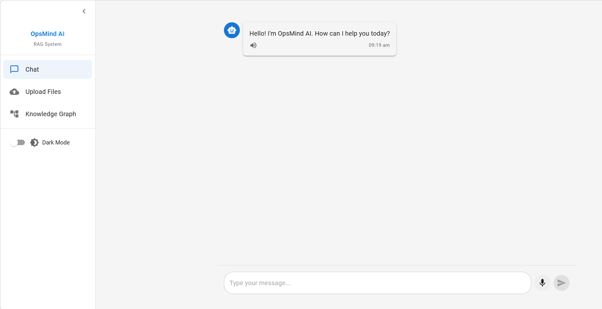
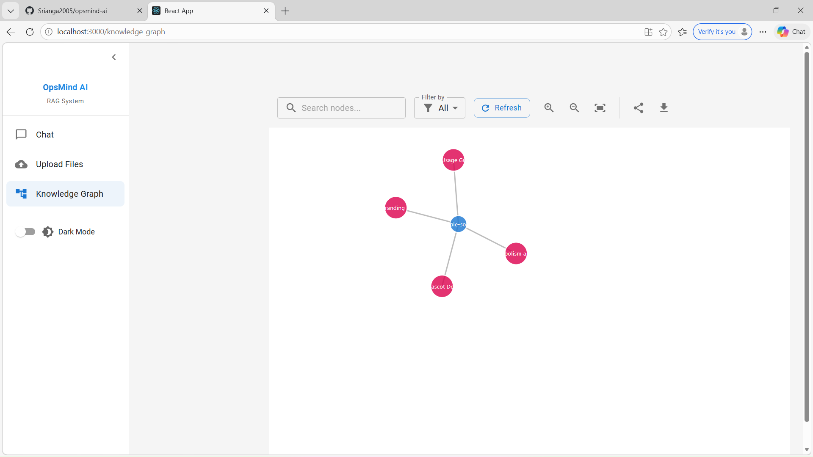
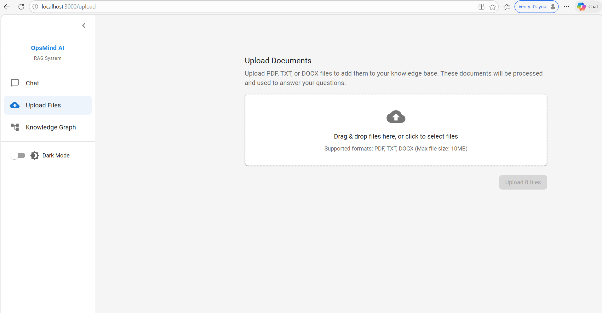

# OpsMind AI - Enterprise RAG System
OpsMind AI is a fullstack Retrieval-Augmented Generation (RAG) system built to parse enterprise Standard Operating Procedures (SOPs) and synthesize answers using Google's Gemini LLMs. It features a modern React frontend capable of visually mapping AI logic into Knowledge Graphs, supporting rich chat interfaces, and processing drag-and-drop document ingestion natively into vector databases.

## 🌟 Key Features

### 1. 🤖 Intelligent Chat Interface
A sleek, modern chat interface where users can directly communicate with the AI.
- Multi-turn conversation logic connected to a MongoDB backend history.
- Real-time answers augmented with exact citations and document source snippets.
- Built-in **Text-to-Speech** (Read Aloud) functionalities.




### 2. 🕸️ Dynamic Knowledge Graph
A specialized feature designed to bring transparency to AI. 
- Visualizes extracted concepts from uploaded SOPs.
- Maps entity relationships using interactive node connections.
- Allows users to visually trace exactly where the AI is sourcing its knowledge clusters.




### 3. 📂 Seamless File Upload
An intuitive Drag-and-Drop zone for expanding the AI's "Brain".
- Supported auto-parsing formats: `PDF`, `TXT`, `DOCX`.
- Files are chunked and converted into vector embeddings instantly upon upload.




### 4. 🌗 Dark / Light Mode
Aesthetically pleasing themes utilizing Material-UI to switch seamlessly between a pristine Light Mode and high-contrast Dark Mode across all components.

---

## 🛠️ Technology Stack
- **Frontend**: React.js, Material-UI (MUI), React Router, React Query
- **Backend**: Node.js, Express.js, Mongoose
- **Database**: MongoDB (Vector Search & Data Storage)
- **AI Integrations**: Google Gemini (`gemini-2.5-flash`, `gemini-embedding-001`)

## 🚀 Quick Start Guide

### Prerequisites
Make sure you have Node.js installed and access to a MongoDB database. You will also need an API key from Google AI Studio.

### Installation

1. **Clone the repository**
   ```bash
   git clone https://github.com/Srianga2005/opsmind-ai.git
   cd opsmind-ai
   ```

2. **Install all dependencies**
   Utilize the built-in script to install packages for the root, frontend, and backend simultaneously.
   ```bash
   npm run install-all
   ```

3. **Environment Setup**
   Navigate to the `backend` folder and create a `.env` file based on `.env.example`:
   ```bash
   NODE_ENV=development
   PORT=5000
   MONGODB_URI=your_mongodb_connection_string
   JWT_SECRET=your_jwt_secret
   GOOGLE_AI_API_KEY=your_gemini_api_key
   ```

4. **Run the Application Locally**
   Return to the root directory and start both servers concurrently:
   ```bash
   npm run dev
   ```

5. The application will be live at `http://localhost:3000`.
